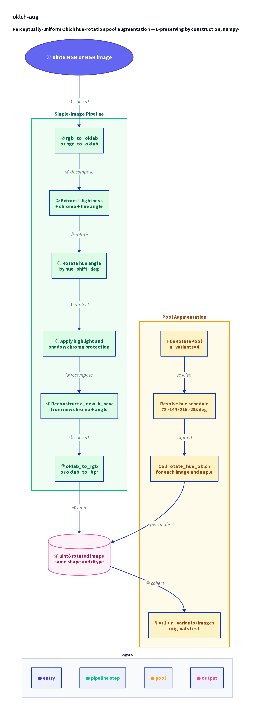

# oklch-aug

> Perceptually-uniform Oklch hue-rotation pool augmentation.
> L-preserving by construction. numpy-core, torch optional.

A Python library that rotates image hue in the Oklab color space rather than HSV/HSL,
keeping **Oklab L (lightness) mathematically fixed** at every pixel. This lets you
generate visibly different color variants of an image without moving the gray-level
structure that a pretrained matcher, retriever, or policy depends on. Extracted from
[hinanohart/mosaicraft](https://github.com/hinanohart/mosaicraft)
where it was used to expand photomosaic tile pools fed to Hungarian/Sinkhorn assignment.

<p align="center">
  
</p>

**Top row** — the same photo rotated through six hues with `rotate_hue_oklch`.
**Bottom row** — the Oklab L channel of each rotated image. By construction
they are pixel-for-pixel identical: hue rotation in Oklab fixes L. That is
exactly the invariant a pretrained matcher / retriever / policy needs.

---

## Architecture

<div align="center">
  
</div>

---

## Why not HSV?

Most color augmenters live in HSV/HSL, which is **not** perceptually uniform: a
30° shift through orange looks small, the same shift through cyan looks large, and
the *lightness* coupled into V drifts as you rotate. That drift disrupts the
gray-level structure a downstream policy or matcher learned to rely on.

Oklch hue rotation (Björn Ottosson, 2020) is different: rotating chroma at fixed
Oklab L is **mathematically** L-preserving — every pixel keeps its luminance, only
its color shifts.

### Why this matters: HSV drifts L, oklch does not

<p align="center">
  
</p>

Same +120° hue shift, two color spaces. The bottom row shows |ΔL| against the
original. HSV's median |ΔL| is in the double digits — the gray-level structure
your matcher learned to rely on has moved. oklch's median is < 1 LSB (the residual
is uint8 round-trip + sRGB gamut clipping, both characterised in `rotate_hue_oklch`'s
docstring).

---

## Install

```bash
pip install oklch-aug                       # numpy only
pip install "oklch-aug[torch]"              # + torch metric and Torch adapter
pip install "oklch-aug[albumentations]"     # + Albumentations/AlbumentationsX adapter
```

Python 3.10+ required.

---

## Quick start

```python
import numpy as np
from oklch_aug import HueRotatePool, rotate_hue_oklch

# Single-image rotation — L is unchanged
rgb = np.random.randint(0, 256, (224, 224, 3), dtype=np.uint8)
rotated = rotate_hue_oklch(rgb, hue_shift_deg=120.0)
# rotated.shape == rgb.shape, dtype == uint8, Oklab L is unchanged.

# Pool expansion — 8 images -> 40 images (4 hue variants + originals)
pool = HueRotatePool(n_variants=4)
expanded = pool([rgb for _ in range(8)])
# len(expanded) == 8 * 5 == 40
```

### See the hue sweep

<p align="center">
  
</p>

Every frame above shares the same Oklab L — only the chroma rotates.

---

## How it works

### Single-image rotation: `rotate_hue_oklch`

1. Convert uint8 sRGB → float64 Oklab via `rgb_to_oklab` (or `bgr_to_oklab`).
2. Decompose Oklab `(L, a, b)` into lightness `L`, chroma `√(a²+b²)`, and hue
   angle `atan2(b, a)`.
3. Add `hue_shift_deg` (converted from degrees to radians) to the hue angle. `L` is untouched.
4. Optionally scale chroma with `chroma_scale` and fade it near highlights
   (`protect_highlights`) or shadows (`protect_shadows`) to avoid color casts
   on specular or near-black regions.
5. Reconstruct `(a_new, b_new)` and convert back to uint8 sRGB.

L is preserved *exactly* in float64. The uint8 round-trip introduces a
sub-LSB median error; the dominant source of any tail deviation is sRGB gamut
clipping, not quantisation (see docstring for the empirical CDF reference).

### Pool expansion: `HueRotatePool`

`HueRotatePool(n_variants=4)` wraps `rotate_hue_oklch` and expands an `N`-image
pool into `N × (1 + n_variants)` images at evenly-spaced hue angles (default:
72°, 144°, 216°, 288°). Originals come first; rotated variants follow in stable
order so downstream bipartite-matching indices are reproducible.

### Pool augmentation, one call

<p align="center">
  
</p>

`HueRotatePool(n_variants=4)` expands each pool image into 5 visibly-different
copies at identical luminance — feeds straight into bipartite-matching /
retrieval pools that want a larger candidate set without the
fidelity-vs-diversity tradeoff of HSV jitter.

> All four figures above are produced by `python scripts/make_readme_demo.py`
> (re-runnable, deterministic, takes seconds).

---

## Use case: domain randomization for robot vision

oklch-aug was extracted from
[`hinanohart/mosaicraft`](https://github.com/hinanohart/mosaicraft),
a photomosaic research codebase. The reason a robot-vision project needed an
L-preserving hue rotator is simple: standard color jitter (HSV / HSL /
value-stretching) drifts the gray-level structure that manipulation policies,
matchers, and retrieval heads have learned to rely on. If you want a vision-based
policy to be invariant to **room lighting / sensor color / specular cast** without
unlearning its geometry, you want oklch-aug, not HSV jitter.

### One scene, 8 color casts

<p align="center">
  
</p>

A real photo treated as a stand-in for a wrist-camera tabletop view. For a
manipulation policy / pose head / grasp head, this is exactly the batch shape
you want: **same geometry, same shadow layout, same luminance** — only the chroma
varies. The policy sees one trajectory under many color casts and learns to ignore
the color channel as a spurious feature.

### Continuous lighting sweep

<p align="center">
  
</p>

What "lighting / color robustness" looks like at the data-loader level.
Every frame is L-identical to the rest by construction.

### Pool expansion for retrievers / matchers

<p align="center">
  
</p>

This is the original motivation in `mosaicraft-active-vision`'s
Hungarian-vs-Sinkhorn benchmark: a Hungarian / Sinkhorn / CLIP-style matcher gets
a 5× larger candidate pool from a single reference scene, all at identical
luminance, without the L-drift HSV jitter introduces. Whether that *improves*
policy / matcher performance on a real robot remains an open empirical question
(the preprint is in submission); but this is what the inputs look like.

> Robotics figures are produced by `python scripts/make_robotics_demo.py`.
> They use `skimage.data.coffee()` as a real-photo proxy for a wrist camera
> — no Gym / Bullet / MuJoCo dependency.

---

## Adapters

### Albumentations / AlbumentationsX

```python
import albumentations as A
from oklch_aug.adapters.albumentations import OklchHueRotation

pipeline = A.Compose([
    OklchHueRotation(hue_shift_range=(-180, 180), chroma_scale=1.0, p=0.5),
    A.HorizontalFlip(p=0.5),
])
out = pipeline(image=img)["image"]
```

### Torch

```python
import torch
from oklch_aug.adapters.torch import OklchHueRotation

aug = OklchHueRotation(hue_shift_deg=72.0)
x = torch.rand(4, 3, 64, 64)            # B, C, H, W float32 in [0, 1] RGB
y = aug(x)                               # same shape / dtype
# Round-trips through CPU numpy; non-differentiable (warns on
# requires_grad=True; rejects integer dtypes / out-of-range values).
```

This is a plain `nn.Module`, not a `kornia.augmentation.AugmentationBase2D`
subclass — use it inside torch / torchvision / kornia pipelines as a
fixed-policy transform, but expect no autograd, no per-batch parameter
generation, and no `same_on_batch`-style coupling.

---

## API reference

| Symbol | Description |
|---|---|
| `rotate_hue_oklch(image, hue_shift_deg, ...)` | Single image, L-exact rotation. uint8 in, uint8 out. |
| `HueRotatePool(n_variants=4)` | Expand an N-image pool to N×(1+k) at evenly-spaced angles. |
| `rgb_to_oklab` / `bgr_to_oklab` | numpy-only sRGB → Oklab, cv2-free. |
| `oklab_to_rgb` / `oklab_to_bgr` | Oklab → sRGB uint8. |
| `oklab_distance(a, b)` | Pairwise Euclidean perceptual distance (numpy). |
| `oklab_distance_torch` | Differentiable variant (optional, requires `torch` extra). |

---

## Provenance

Extracted from
[hinanohart/mosaicraft](https://github.com/hinanohart/mosaicraft)
(`color_augment.py`, `color.py`) where the technique was first used to expand
photomosaic tile pools fed to a Hungarian assignment. Verified absent (as of
2026-05-16) from albumentations, AlbumentationsX, kornia, torchvision, and DALI.
The torch adapter exposes a plain `nn.Module`; no `kornia.augmentation.AugmentationBase2D`
subclass is shipped (deliberately — see the Torch section above).

---

## License

[MIT](LICENSE). Matches `mosaicraft` upstream.

